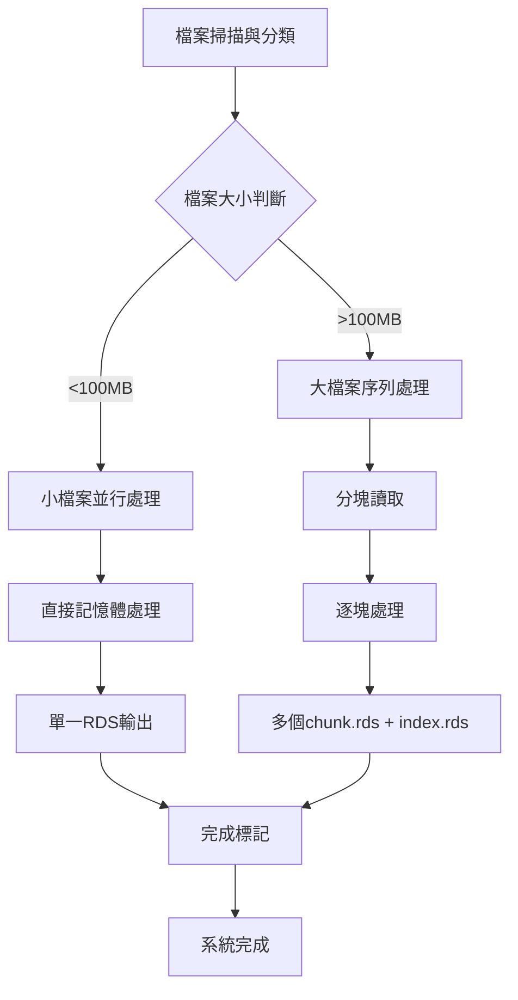

# AQI時間序列滑動窗口資料產生系統 - 生產級說明文件

## 📋 系統概述

本系統是專為AQI時間序列分析設計的**生產級滑動窗口資料產生工具**，能夠處理大規模時間序列資料（3.26M筆記錄，2020-2024年），自動產生機器學習所需的滑動窗口格式資料。

### 🎯 核心功能
- **智能檔案分類**: 自動識別小檔案(<100MB)和大檔案(>100MB)
- **記憶體安全處理**: 分批處理避免記憶體溢出，支援64GB RAM環境
- **並行處理**: 小檔案並行，大檔案序列處理
- **容錯機制**: 自動fallback、進度追蹤、斷點續傳
- **多格式支援**: CSV/Feather格式自動優化

---

## 🏗️ 系統架構

### 1. 資料分類架構
```
原始資料結構:
├── DATA/Separate/              # 分站原始資料 (75個檔案, ~6MB each)
├── DATA/Separate_Nomorlization/ # 分站標準化資料 (75個檔案, ~16MB each)  
├── DATA/Combine/               # 合併原始資料 (1個檔案, 958MB)
└── DATA/Combine_Nomolization/  # 合併標準化資料 (1個檔案, 1.8GB)

輸出結構:
sliding_windows_production/
├── Separate/                   # 分站原始窗口 (75個.rds檔案)
├── Separate_Normalization/     # 分站標準化窗口 (75個.rds檔案)
├── Combine/                    # 合併原始窗口 (17個chunk + 1個index)
├── Combine_Normalization/      # 合併標準化窗口 (17個chunk + 1個index)
└── progress/                   # 進度追蹤檔案
```

### 2. 處理流程架構


---

## 📊 滑動窗口邏輯詳解

### 1. 核心參數設定
```r
input_seq_len   <- 72    # 輸入序列長度 (72小時 = 3天)
output_horizon  <- 1     # 預測時間範圍 (1小時)
stride          <- 1     # 滑動步長 (1筆)
chunk_size      <- 200000 # 大檔分塊大小 (20萬筆)
overlap         <- 72    # 區塊重疊 (input_seq_len + output_horizon - 1)
```

### 2. 窗口產生邏輯
```
時間序列: [t1, t2, t3, ..., tn]

窗口1: X=[t1:t72],  y=t73
窗口2: X=[t2:t73],  y=t74  
窗口3: X=[t3:t74],  y=t75
...
窗口k: X=[tk:t(k+71)], y=t(k+72)

最大窗口數 = n - input_seq_len - output_horizon + 1
```

### 3. 大檔案分塊策略
```
檔案總長度: N筆
分塊大小: 200,000筆
重疊區域: 72筆

區塊1: [1 : 200,000]
區塊2: [199,929 : 399,928]  # 重疊72筆確保窗口連續
區塊3: [399,857 : 599,856]
...

每個區塊獨立產生窗口，避免跨區塊窗口遺漏
```

---

## 🔧 技術特性與優化

### 1. 記憶體安全機制
- **動態記憶體監控**: 實時追蹤記憶體使用量
- **分批處理**: 超過100萬窗口自動分批
- **及時清理**: 每個處理階段後立即釋放記憶體
- **記憶體上限**: 單檔最大100萬窗口 (~20GB RAM)

### 2. 性能優化技術
- **Arrow整合**: 自動Feather格式轉換 (小檔案<200MB)
- **並行處理**: future.apply多核心處理小檔案
- **向量化操作**: 避免R-level迴圈
- **壓縮儲存**: xz壓縮減少磁碟空間

### 3. 容錯與恢復機制
- **進度追蹤**: 每個檔案完成後建立.flag檔案
- **斷點續傳**: 自動跳過已完成檔案
- **自動fallback**: Arrow失敗自動切換到fread
- **錯誤隔離**: 單一檔案失敗不影響整體處理

---

## 📥 輸入資料格式

### 1. 必要欄位
```r
# 所有輸入CSV檔案必須包含:
date        # 時間戳記 (POSIXct或字串格式)
AQI_aqi     # 目標變數 (預測目標)
# 其他特徵欄位 (依資料集而異)
```

### 2. 支援的資料集類型
- **Separate**: 分站原始資料，包含基本AQI指標
- **Separate_Normalization**: 分站標準化資料，數值已正規化
- **Combine**: 合併所有站點的原始資料
- **Combine_Normalization**: 合併所有站點的標準化資料

### 3. 特徵自動檢測
系統會自動檢測每個資料集的特徵清單：
```r
# 典型特徵包含:
AQI_so2, AQI_co, AQI_o3, AQI_pm10, AQI_pm2.5, AQI_no2, ...
Weather_Tx, Weather_RH, Weather_WS, Weather_WD, ...
Factory_city, Factory_district, ...
AQI_pollutant_0~5, label_51~78, ...
month_sin, hour_sin, day_sin  # 時間特徵
```

---

## 📤 輸出資料格式

### 1. 小檔案輸出 (單一RDS檔案)
```r
# 檔案命名: {原檔名}_windows.rds
# 資料結構:
list(
  X_raw = array(n_windows, 72, n_features),  # 輸入特徵矩陣
  y_raw = numeric(n_windows),                # 目標變數向量
  features = character(n_features),          # 特徵名稱清單
  data_type = "separate"                     # 資料集類型
)
```

### 2. 大檔案輸出 (多個chunk + 索引)
```r
# 區塊檔案: {原檔名}_chunk01.rds, chunk02.rds, ...
# 每個區塊結構同小檔案

# 索引檔案: {原檔名}_index.rds
list(
  chunk_files = c("chunk01.rds", "chunk02.rds", ...),
  total_windows = 3268728,                   # 總窗口數
  n_chunks = 17,                            # 區塊數量
  features = character(n_features),          # 特徵清單
  data_type = "combine",                    # 資料集類型
  seq_len = 72,                             # 序列長度
  target = "AQI_aqi",                       # 目標變數名
  output_dir = "sliding_windows_production/Combine"
)
```

---

## 🚀 使用方法

### 1. 環境準備
```r
# 必要套件 (系統會自動安裝)
install.packages(c("data.table", "zoo", "abind", "fasttime", 
                   "future.apply", "arrow"))

# 系統需求
# - R 4.0+
# - 64GB RAM (建議)
# - 足夠磁碟空間 (原始資料的10-15%)
```

### 2. 執行方式
```bash
# 直接執行
Rscript generate_sliding_windows_production.R

# 背景執行 (建議)
nohup Rscript generate_sliding_windows_production.R > output.log 2>&1 &
```

### 3. 進度監控
```bash
# 檢查進度檔案
ls sliding_windows_production/progress/*.flag | wc -l

# 檢查記憶體使用
tasklist /FI "IMAGENAME eq Rscript.exe"

# 檢查輸出檔案
ls -la sliding_windows_production/*/
```

---

## 📖 資料讀取範例

### 1. 讀取小檔案窗口
```r
# 讀取單一站點資料
w <- readRDS('sliding_windows_production/Separate/二林_C0G730_combined_windows.rds')

# 提取特徵和標籤
X <- w$X_raw    # [n_windows, 72, n_features]
y <- w$y_raw    # [n_windows]
features <- w$features
data_type <- w$data_type

cat("窗口數量:", dim(X)[1], "\n")
cat("時間步長:", dim(X)[2], "\n") 
cat("特徵數量:", dim(X)[3], "\n")
cat("特徵清單:", paste(features[1:5], collapse=", "), "...\n")
```

### 2. 讀取大檔案窗口
```r
# 讀取索引檔案
idx <- readRDS('sliding_windows_production/Combine/Combine_AllData_index.rds')

cat("總窗口數:", format(idx$total_windows, big.mark=","), "\n")
cat("區塊數量:", idx$n_chunks, "\n")

# 逐區塊讀取處理
for(chunk_file in idx$chunk_files) {
  chunk_path <- file.path(idx$output_dir, chunk_file)
  w <- readRDS(chunk_path)
  
  # 處理當前區塊
  X_chunk <- w$X_raw
  y_chunk <- w$y_raw
  
  cat("處理區塊:", chunk_file, "窗口數:", length(y_chunk), "\n")
  
  # 您的模型訓練或分析代碼
  # model <- train_model(X_chunk, y_chunk)
}
```

### 3. 批次載入所有資料
```r
# 載入所有小檔案
load_all_small_files <- function(data_type = "separate") {
  dir_map <- list(
    separate = "Separate",
    separate_norm = "Separate_Normalization"
  )
  
  dir_path <- file.path("sliding_windows_production", dir_map[[data_type]])
  files <- list.files(dir_path, pattern = "_windows\\.rds$", full.names = TRUE)
  
  all_X <- list()
  all_y <- list()
  
  for(file in files) {
    w <- readRDS(file)
    all_X[[basename(file)]] <- w$X_raw
    all_y[[basename(file)]] <- w$y_raw
  }
  
  return(list(X = all_X, y = all_y))
}

# 使用範例
data <- load_all_small_files("separate")
```

---

## ⚙️ 進階配置與調優

### 1. 記憶體調優
```r
# 根據系統記憶體調整
MAX_WINDOWS_PER_FILE <- 1000000  # 64GB RAM
# MAX_WINDOWS_PER_FILE <- 500000   # 32GB RAM  
# MAX_WINDOWS_PER_FILE <- 250000   # 16GB RAM

# 調整分塊大小
chunk_size <- 200000  # 預設20萬筆
# chunk_size <- 100000  # 記憶體較小時
# chunk_size <- 500000  # 記憶體充足時
```

### 2. 並行處理調優
```r
# 調整工作進程數
workers <- max(1, min(parallel::detectCores() - 1, 8))
# workers <- 4  # 最大應該可以調到12 以目前狀況 還沒測試
# workers <- 4  # 手動指定

# 關閉並行處理 (除錯時)
# future::plan(future::sequential)
```

### 3. 儲存格式調優
```r
# 壓縮等級調整
saveRDS(w, output_path, compress = "xz")     # 最高壓縮
# saveRDS(w, output_path, compress = "gzip")  # 平衡
# saveRDS(w, output_path, compress = FALSE)   # 最快速度
```

---

## 🔍 故障排除

### 1. 常見問題
**Q: 記憶體不足錯誤**
```r
# 解決方案:
# 1. 降低 MAX_WINDOWS_PER_FILE
# 2. 減少 chunk_size
# 3. 關閉其他程式釋放記憶體
```

**Q: Arrow套件安裝失敗**
```r
# Windows解決方案:
Sys.setenv(ARROW_PRE_0_17_IPC_FORMAT = "1")
install.packages("arrow", INSTALL_opts = "--no-multiarch")

# 或跳過Arrow使用純R處理
arrow_available <- FALSE
```

**Q: 檔案路徑找不到**
```r
# 檢查路徑設定
DATA_DIRS <- list(
  separate = "DATA/Separate",      # 注意大小寫
  separate_norm = "DATA/Separate_Nomorlization", 
  combine = "DATA/Combine",
  combine_norm = "DATA/Combine_Nomolization"
)
```

### 2. 效能監控
```bash
# 監控系統資源
htop                    # Linux
Get-Process Rscript     # Windows PowerShell

# 監控磁碟空間
df -h                   # Linux  
Get-PSDrive C           # Windows PowerShell

# 監控進度
tail -f output.log      # 即時查看日誌
```

### 3. 資料驗證
```r
# 驗證輸出資料完整性
verify_output <- function() {
  # 檢查檔案數量
  separate_files <- length(list.files("sliding_windows_production/Separate"))
  cat("Separate檔案數:", separate_files, "/75\n")
  
  # 檢查大檔案區塊
  combine_chunks <- length(list.files("sliding_windows_production/Combine", 
                                     pattern = "chunk.*\\.rds"))
  cat("Combine區塊數:", combine_chunks, "\n")
  
  # 檢查索引檔案
  index_exists <- file.exists("sliding_windows_production/Combine/Combine_AllData_index.rds")
  cat("索引檔案存在:", index_exists, "\n")
}

verify_output()
```

---

## 📈 效能基準

### 1. 處理速度基準 (64GB RAM, 32核心)
- **小檔案**: ~0.5分鐘/檔案 (平均6MB)
- **大檔案**: ~2小時/GB (包含窗口產生)
- **總處理時間**: ~4-6小時 (完整資料集)

### 2. 記憶體使用基準
- **小檔案處理**: 峰值 ~2GB
- **大檔案處理**: 峰值 ~20-25GB  
- **並行處理**: 額外 ~8GB (8個工作進程)

### 3. 磁碟空間需求
- **輸入資料**: ~2.8GB (原始CSV)
- **輸出資料**: ~400MB (壓縮RDS)
- **臨時檔案**: ~1GB (Feather快取)
- **建議可用空間**: >10GB

---

## 🎯 最佳實踐建議

### 1. 生產環境部署
- 使用專用伺服器，避免資源競爭
- 定期備份輸出資料
- 設定自動化監控和告警
- 建立標準化的執行流程

### 2. 資料品質控制
- 執行前檢查輸入資料完整性
- 監控NA值比例和處理結果
- 驗證時間序列連續性
- 定期抽樣檢查輸出品質

### 3. 維護與更新
- 定期更新R套件版本
- 監控系統效能變化
- 根據資料量增長調整參數
- 建立版本控制和變更記錄

---

## 📞 技術支援

如遇到問題，請提供以下資訊：
1. 系統環境 (OS, R版本, 記憶體大小)
2. 錯誤訊息完整內容
3. 輸入資料規模和格式
4. 執行日誌檔案

**系統版本**: 生產級最終版 v1.0
**最後更新**: 2025年6月
**相容性**: R 4.0+, Windows/Linux 